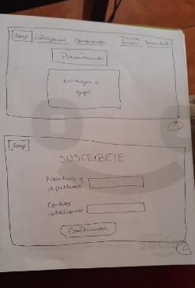
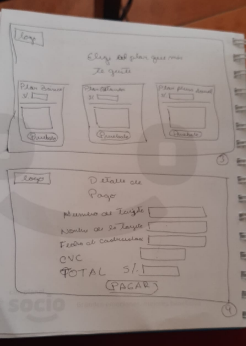
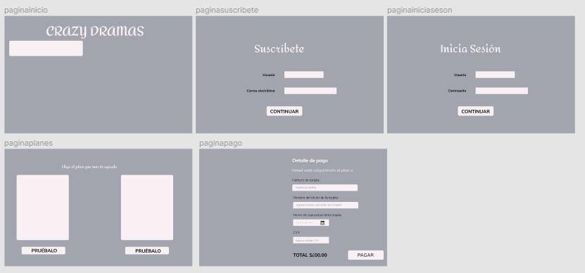
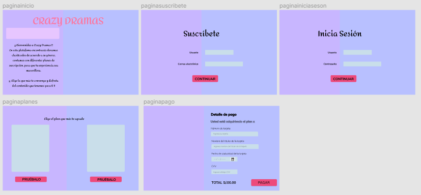
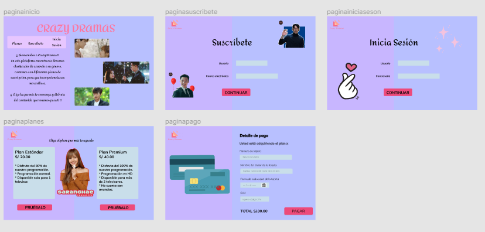

#  Proyecto Tarjeta de Crédito Válida: Crazy Dramas
En este proyecto se presenta la página Crazy Dramas, que es un servicio de streaming por suscripción que les permite a los usuarios ver entretenerse y disfrutar doramas coreanos.
## Objetivos del Proyecto
La página tiene como finalidad que el usuario fanático de este tipo de contenido pueda entretenerse en la comodidad de su hogar y desde cualquier dispositivo, nuestro catálogo de doramas disponibles.
## Proceso de Diseño
Al haber tomado conocimiento del proyecto y después de haber leído las bases de este, se realizó los primeros bocetos con papel y lapiz teniendo como ideas base WebApps de suscripciones como Netflix y Rakuten Viki.
Investigando sobre la temática y en base a mi experiencia personal, ya que me considero fanática de este contenido, decidí tomar esto como base y crear Crazy Dramas como una página de entretenimiento.
Para poder empezar el diseño tuvimos que reforzar el manejo adecuado de Figma. Logré tener un feedback con mis compañeras de squad y una de las coach, así como también de mi familia, del cual obtuve ideas y mejoras que se podrían realizar. Una vez definido esta parte del proceso, elegí la paleta de colores del diseño y fuentes.
Se usó un lenguaje coloquial y divertido para que el usuario se sienta en confianza de acceder a la suscripción y pueda compartir esto con amigos recomendando nuestra página.
Crazy Dramas va dirigido a un público de entre 18 a 50 años que consume variadas aplicaciones web de streaming y que disfrute del contenido de la cultura asiática como entretenimiento. Consideramos que debido a la coyuntura tanto nacional como mundial los usuarios buscan cada vez más maneras de relajarse y divertirse por lo que esta página encaja adecuadamente. 
Este es el proceso de como pudimos crear esta WebApp con el fin de divertir al usuario a la vez que brindamos un entretenimiento en la comodidad de su hogar.
 
## Screenshots del Proceso de Diseño.

## Boceto de papel

## Maqueta Base

## Maqueta Base-Prueba

## Maqueta Base-Prueba final

## Maqueta Final

## Diseño de la Interfaz de usuario
Diseño creado en Figma.

https://www.figma.com/file/SPi89a5J6dLZmccE8wlgEc/Untitled?node-id=3%3A0

